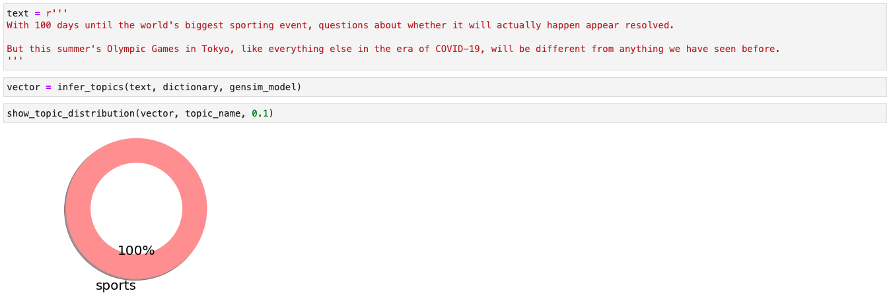
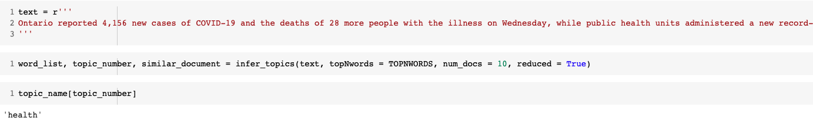

# Automatic Topic Extraction from Articles
The objective is to develop an automated tool, which can find out topics from any article. Different topic modeling techniques are investigated for this topic extraction task. For the investigation, yahoo answer dataset has been chosen. The dataset has ~1.5M question-answer pairs. Only 60,000 samples has been randomly chosen from the data. From the selected data, only the answers are used to train the models. The models are trained using [LDA](https://www.jmlr.org/papers/volume3/blei03a/blei03a.pdf?TB_iframe=true&width=370.8&height=658.8) and [Top2Vec](https://arxiv.org/abs/2008.09470). The main dataset can be found in the following link:
https://www.kaggle.com/soumikrakshit/yahoo-answers-dataset!

## Model 1: Topic Model - LDA: 
• Different preprocessing strategies (e.g., lemmatization, stop word removal) are followed to process the input text.  
• Topic Coherence metric is used to select the number of topics to generate (20 topics) using LDA model. 
• The topics are further analyzed to give them a semantic name. (e.g., naming "topic 1" to "science"). 
• The trained model is used to extract topics from unknown documents. 

## Model 2: Topic Model - Top2Vec:
• This model does not need any pre-processing so the raw text (only removed hyperlinks) is used for the model training. 
• For generating the document vectors, bert embeddings are used. 
• Hierarchical topic reduction has been used to reduce the generated topics to 20. 
• Topic labeling is performed to generate a semantic name for all the 20 topics. 
• The trained model is used to extract topics from unknown documents. 

# Topic Labeling Process:
To genearate a semantic name for the generated topics the following steps are followed.

1. Find the top representative documents for each topic and qualitatively analyze them to get a common theme.
2. Investigate the word distributions for each topic.
3. Name the topic with a keyword which supports the words (i.e., from word distributions) as well the theme portrayed in the documents (i.e., representative documents).

# How to run:
Run the code in the following order to train a topic model: 

1. yahoo_answer_lda.ipynb: This file is used to train the lda model.
2. yahoo_answer_lda_result.ipynb: This file is used to analyze the lda model's results and give a name to each generated topic (e.g., topic-labeling).
3. yahoo_answer_lda_infer.ipynb: This file is used to test the lda model with unknown data.
4. yahoo_answer_top2vec.ipynb: This file is used to train the top2vec model.
5. yahoo_answer_top2vec_result.ipynb: This file is used to analyze the top2vec model's results and give a name to each generated topic (e.g., topic-labeling).
6. yahoo_answer_top2vec_infer.ipynb: This file is used to test the top2vec model with unknown data.
